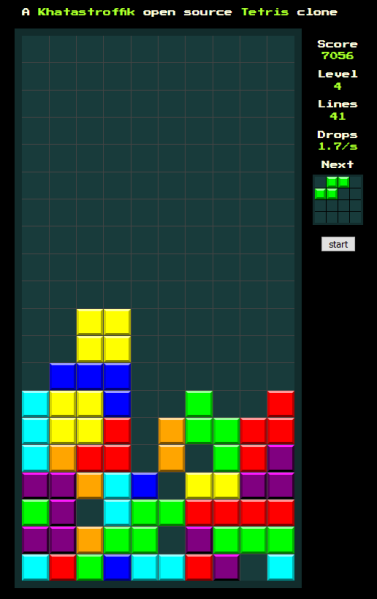

# Tetris (work-in-progress)

A [Khatastroffik](https://www.khatastroffik.net) open source **Tetris** clone.

## Proof-of-Concept

This Angular web application is a **PoC** combining the following:

- [x] **SoC** (Separation of Concern) &rightarrow; decoupling UI and game engine implementation
- [x] **RMD** (Responsive and Mobile design) &rightarrow; playable with keyboard or buttons, sized for any device (not relying on media queries, though)
- [x] **ReactiveX** (Reactive Extensions) &rightarrow; asynchronous programming with **RxJs** observables
- [x] **CSS grid** (grid layout) &rightarrow; pure HTML5 & CSS3 design (requires use of a modern browser)
- [ ] **PWA** (Progressive Web App) &rightarrow; 1 source for "*browser*" or "*local install &amp; offline*" usage

## Tetris game

The *well-known* **Tetris game** - hence having well-defined requirements - is implemented with respect to:

- [x] SRS
- [x] wall bounce back
- [x] progressive difficulty (up to 20 levels) and scoring (e.g. multiple rows)
- [x] pausable
- [x] ...

TODO: implement PWA (electron?)
TODO: improve README!
TODO: fix rotation bugs (on top of board, on the board sides)
TODO: refactor app component: create sub components for board, next tetromino etc.
TODO: implement help screen
